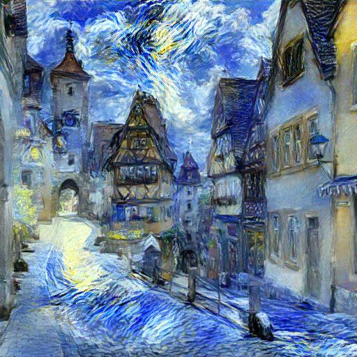

# **Neural Style Transfer**

This repository contains an implementation of the neural style transfer technique as described in the paper *"A Neural Algorithm of Artistic Style"* by **Leon A. Gatys et al.** The method utilizes convolutional neural networks (CNNs) to blend the *content* of one image with the *style* of another, creating visually striking results.

---

## **Project Overview**

The goal of this project is to perform **Neural Style Transfer (NST)** using a pre-trained **VGG19** network. The implementation is modular, allowing for easy customization and experimentation. 

---

## **Project Structure**

```
Neural_Style_Transfert/
├── data/
│   ├── content/                    # Folder for content images
│   ├── style/                      # Folder for style images
│   └── generated/                  # Folder for generated output
├── src/
│   ├── NST_Model.py                # Neural Style Transfer implementation
│   ├── VGG19.py                    # Pre-trained VGG19 model utility
├── neural_style_transfer.ipynb     # Jupyter Notebook for experimentation
├── README.md                       # Project documentation
└── requirements.txt                # Python dependencies
```

---

## **Results**

Here are some examples of the generated results:

| Content Image       | Style Image         | Generated Result    |
|---------------------|---------------------|---------------------|
|  |  |  |

---

## **Getting Started**

### **1. Clone the Repository**
```bash
git clone https://github.com/safina57/Neural-Style-Transfer.git
cd Neural_Style_Transfert
```

### **2. Install Dependencies**
Make sure you have Python 3.8 or later installed. Then, install the required dependencies:
```bash
pip install -r requirements.txt
```

### **3. Prepare Your Images**
- Place your **content** images in the `data/content/` folder.
- Place your **style** images in the `data/style/` folder.

---

## **Using the Jupyter Notebook**

For experimentation or detailed control, you can use the included Jupyter Notebook:
```bash
jupyter notebook neural_style_transfer.ipynb
```

This provides a step-by-step breakdown of the style transfer process.

---

## **Key Features**

- **Pre-trained VGG19 Model**: Leverages the pre-trained VGG19 network for feature extraction.
- **Customizability**: Adjust content/style weights, learning rate, and optimizer to experiment with different results.

---

## **Dependencies**

This project requires the following Python packages:

- `torch`, `torchvision`
- `Pillow`
- `matplotlib`
- `numpy`
- `jupyter`

You can find the full list in the `requirements.txt` file.

---

## **References**

1. Gatys, L. A., Ecker, A. S., & Bethge, M. (2015). [A Neural Algorithm of Artistic Style](https://arxiv.org/abs/1508.06576). *arXiv preprint arXiv:1508.06576*.
2. PyTorch Documentation: [https://pytorch.org](https://pytorch.org)

---

